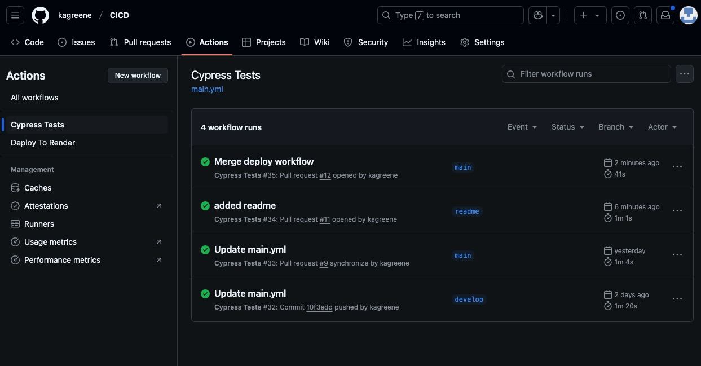

# Github Actions CI/CD for Tech Quiz

## Description 

This application allows the user to complete a quiz with a variety of technical questions. The application's repository has been set up using Github Actions to automatically run component tests when a pull request is made to the develop branch. When a pull-request is made to the main branch, a separate Github Actions workflow is triggered that will automatically deploy the application to Render using the Render deploy hook URL. These workflows allow for better protection of the main branch and ensure that the application is working correctly before it is deployed to Render. 

## Screenshot

Below are screenshots of the workflows successfully running when pull requests are made to the develop and main branches

